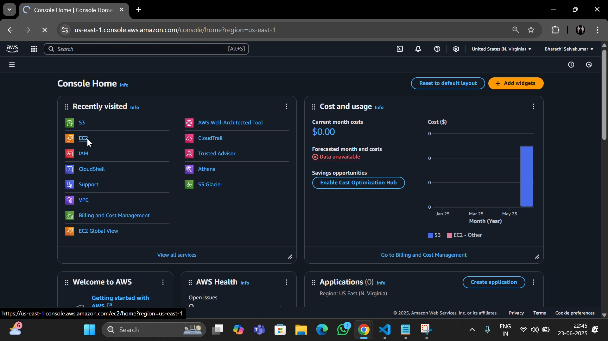
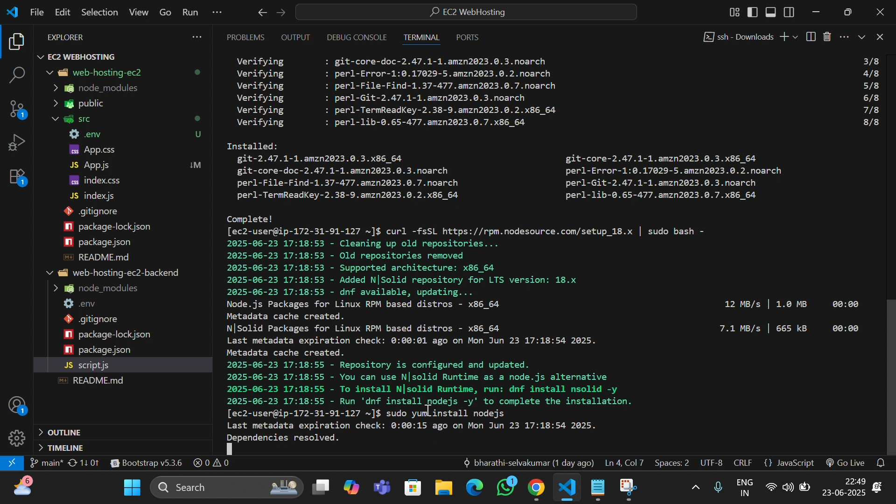
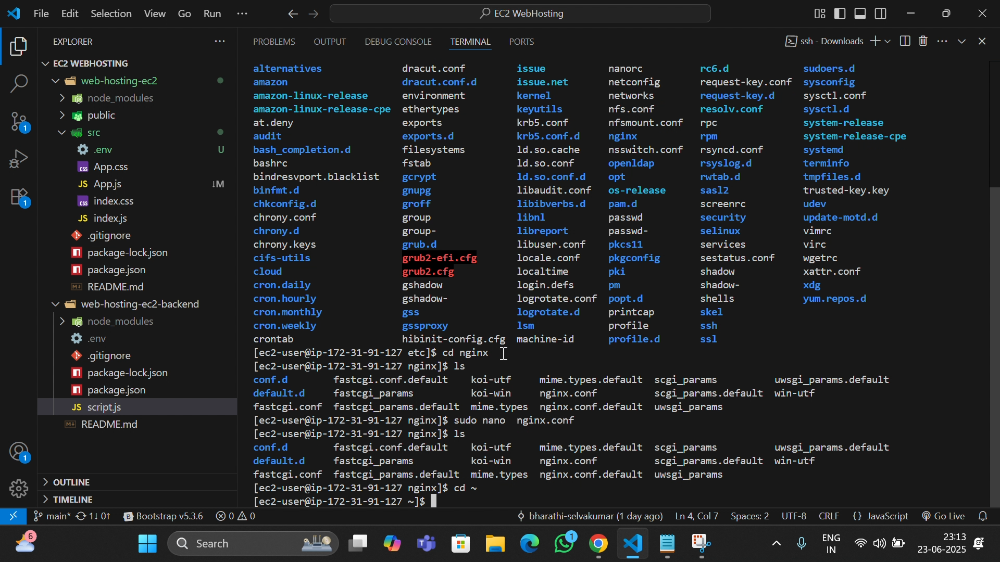

# 🌐 Dynamic Web Hosting on EC2

🚀 A Full-Stack MERN File Upload App Deployed on AWS EC2

This project demonstrates a **complete deployment pipeline** of a MERN stack application where users can upload images/files using a React frontend. These files are stored in an **AWS S3 bucket** using an Express backend. Everything is hosted on a **single EC2 instance**, with **Nginx** acting as a reverse proxy and **PM2** keeping the backend alive.

---

## 📁 Project Structure

```bash
Dynamic-webHosting-EC2/
├── README.md
├── images/
│   ├── Screenshot-1.png
│   ├── Screenshot-2.png
│   └── Screenshot-3.png
├── web-hosting-ec2/ #Frontend
└── web-hosting-ec2-backend/ #Backend

``` 

## 🛠️ Tech Stack

### 🔹 Frontend
- React
- Axios
- Material-UI

### 🔹 Backend
- Node.js
- Express.js
- Multer
- AWS SDK (IAM Role-based, no access keys)

### 🔹 DevOps & Cloud
- Amazon EC2 (Amazon Linux)
- Amazon S3
- Nginx (Reverse Proxy)
- PM2 (Node process manager)
- IAM Roles (for secure AWS access)
- Git & GitHub

---

## ✨ Features

✅ Upload files or images from the frontend  
✅ Store uploaded files directly into S3  
✅ View uploaded files in a responsive gallery  
✅ Backend secured using IAM Role  
✅ Deployed with Nginx + PM2 on a single EC2 instance  
✅ RESTful API architecture

---

## 🧑‍💻 Local Development

### ▶️ Start Frontend
```bash
cd web-hosting-ec2-frontend
npm install
npm start
# Runs at http://localhost:3000
▶️ Start Backend

cd web-hosting-ec2-backend
npm install
node index.js
# Runs at http://localhost:5000
📄 .env Configuration (Backend)
env

✅ Access keys are not used. IAM Role handles all permissions.

🚀 Deployment Steps on EC2
Launch EC2 instance (Amazon Linux)

Attach IAM Role with AmazonS3FullAccess

Clone this GitHub repo

Install dependencies:

sudo yum install nginx git nodejs npm -y
sudo npm install pm2 -g
Build frontend:

cd web-hosting-ec2-frontend
npm run build
sudo cp -r build/* /usr/share/nginx/html/
Run backend with PM2:


cd ../web-hosting-ec2-backend
pm2 start index.js --name backend
Configure Nginx reverse proxy

🔁 Nginx Configuration
nginx

location /api/ {
    proxy_pass http://localhost:5000/;
    proxy_http_version 1.1;
    proxy_set_header Upgrade $http_upgrade;
    proxy_set_header Connection 'upgrade';
    proxy_set_header Host $host;
    proxy_cache_bypass $http_upgrade;
}
📁 React static files are served from:

```
## 📸 Screenshots
  
  

